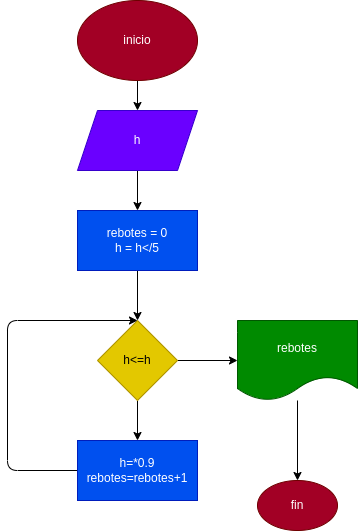

# rebotes de una pelota 
prograama para ver cuantos revote hace una pelota cuando se lanza de una altura x

# ANALISIS

Variabes de entrada (input)

h: altura a la cual se lanzo la pelota 

Variables de proceso y salida (precessing, storage, output)

rebotes: lo rebes q da la pelota 
H: altura acrual 

# DISEÑO

# CONSTRUCCION